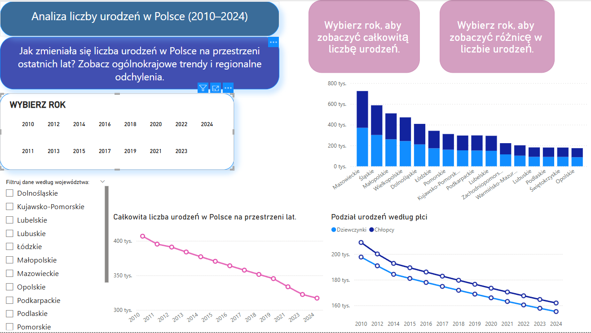
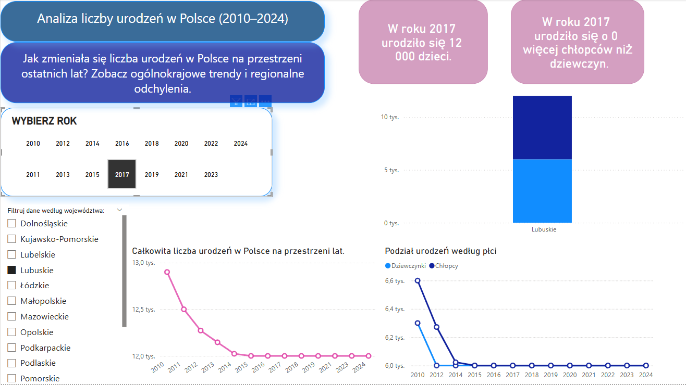

# 📊 Analiza liczby urodzeń w Polsce (2010–2024)

Projekt stworzony w Power BI, którego celem jest przedstawienie zmian w liczbie urodzeń w Polsce na przestrzeni ostatnich kilkunastu lat. Dashboard pozwala szybko zorientować się w trendach ogólnokrajowych oraz różnicach między poszczególnymi województwami.

## 🧠 Cel projektu
- pokazanie długoterminowych zmian w liczbie urodzeń,
- porównanie sytuacji demograficznej w różnych regionach Polski,
- stworzenie przejrzystego dashboardu, który może być używany do eksplorowania danych przez osoby nietechniczne.

## 📌 Zastosowane narzędzia
- Power BI Desktop
- Dane demograficzne z GUS 
- DAX 
- Interaktywne wizualizacje (mapa, linie trendu, wykresy słupkowe)

## 📷 ss

########
